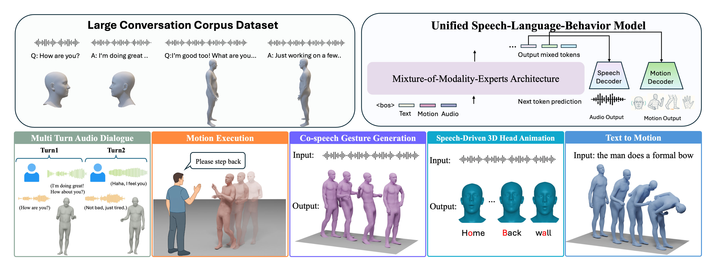

# ViBES

[](https://arxiv.org/pdf/2512.14234)
[](https://ai.stanford.edu/~juze/ViBES/)

This repository contains the official implementation of "ViBES: A Conversational Agent with Behaviorally-Intelligent 3D Virtual Body".

## 🔍 Overview

ViBES is a speech-language-behavior (SLB) model with a mixture-of-modality-experts (MoME) architecture that ingests audio, motion, or text and shares cross-modal information via speech-language-behavior Attention (SLB-Attn).




## ✅ TODO List

- [x] Initial code release
- [x] Inference code for conversational behavior of facial expressions
- [] Inference code for conversational behavior of body (Note: we use motion representation from previous methods, but experiments show global translation is unstable, so we decided to use the representation from GENMO. We will release the body part when ready.)
- [] Training code for face expert
- [] Training code for body expert
- [] Dataset release (facial part)
- [] Dataset release (body part)
- [] Dataset preprocessing


## 🛠️ Environment Setup

Requires Conda, CUDA 12.8+, and GCC 9.0+. Follow installation order carefully.

```bash

git clone --recurse-submodules https://github.com/Juzezhang/ViBES.git
cd ViBES

# Create environment
conda create --name ViBES -y python=3.10
conda activate ViBES

# Install PyTorch with CUDA 12.8
pip install torch torchvision torchaudio --index-url https://download.pytorch.org/whl/cu128
pip install numpy==1.26.4

# Install dependencies
pip install -r requirements.txt
pip install --no-build-isolation "git+https://github.com/facebookresearch/pytorch3d.git@stable"

# Install FlashAttention2 (may take 10-30 min to compile)
export MAX_JOBS=4 NVCC_THREADS=1
pip install -U flash-attn --no-build-isolation

# Install Chumpy and apply patch
pip install "chumpy==0.70" --no-build-isolation
chmod +x ./preprocess/patch_chumpy_numpy2.sh
./preprocess/patch_chumpy_numpy2.sh

# Download GLM-4-Voice components
./scripts/download_glm4voice_modules.sh

# Build resources
./scripts/build_resources.sh

# Download our pretrained model
huggingface-cli download JuzeZhang/ViBES-Face --local-dir ./ViBES-Face
```

**Notes:**
- FlashAttention compilation may take 10-30 minutes
- PyTorch3D requires separate installation


## 🚀 Quick Start

<summary><b>Conversation with Text input</b></summary>

```bash
python inference/inference_a2m_face.py --user_text "If you had a superpower for one day, what would you choose?"
```

Demo output

https://github.com/user-attachments/assets/cd0191fa-394d-4476-aec7-c8aed7fe1690

*Example output showing conversational facial animation with synchronized audio*


## Dataset Preprocessing

To be updated


## Acknowledgements

We thank the following projects for sharing their great work.
- **GLM-4-Voice**: https://github.com/zai-org/GLM-4-Voice
- **Language of Motion**: https://github.com/Juzezhang/language_of_motion
- **ARTalk**: https://github.com/xg-chu/ARTalk/tree/main
- **FLAME**: https://flame.is.tue.mpg.de
- **EMICA**: https://github.com/radekd91/inferno


## Citation
If you find our work useful in your research, please consider citing:
```bibtex
@inproceedings{
      zhang2025vibes,
        title={ViBES: A Conversational Agent with Behaviorally-Intelligent 3D Virtual Body},
      author={Juze Zhang and Changan Chen and Xin Chen and Heng Yu and Tiange Xiang and Ali Sartaz Khan and Shrinidhi Kowshika Lakshmikanth and Ehsan Adeli},
      booktitle={arXiv},
      year={2025},
}
```
