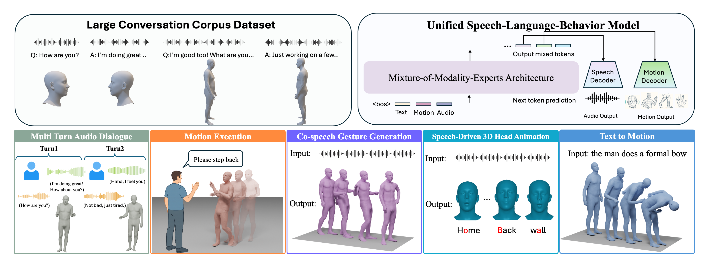

# ViBES

[](https://arxiv.org/pdf/2512.14234)
[](https://ai.stanford.edu/~juze/ViBES/)
[](https://huggingface.co/JuzeZhang/ViBES-Face)

This repository contains the official implementation of "ViBES: A Conversational Agent with Behaviorally-Intelligent 3D Virtual Body".

## 🔍 Overview

ViBES is a speech-language-behavior (SLB) model with a mixture-of-modality-experts (MoME) architecture that ingests audio, motion, or text and shares cross-modal information via speech-language-behavior Attention (SLB-Attn).




## ✅ TODO List

- [x] Initial code release
- [x] Inference code for conversational behavior of facial expressions
- [ ] Inference code for conversational behavior of body (Note: we use motion representation from previous methods, but experiments show global translation is unstable, so we decided to use the representation from GENMO. We will release the body part when ready.)
- [x] Training code for face expert
- [ ] Training code for body expert
- [x] Dataset release (facial part)
- [ ] Dataset release (body part)
- [ ] Dataset preprocessing


## 🛠️ Environment Setup

Requires Conda, CUDA 12.8+, and GCC 9.0+. Follow installation order carefully.

```bash

git clone --recurse-submodules https://github.com/Juzezhang/ViBES.git
cd ViBES

# Create environment
conda create --name ViBES -y python=3.10
conda activate ViBES

# Install PyTorch with CUDA 12.8
pip install torch torchvision torchaudio --index-url https://download.pytorch.org/whl/cu128
pip install numpy==1.26.4

# Install dependencies
pip install -r requirements.txt
# PyTorch3D — build WITH GPU support (run on a machine that has a GPU + nvcc).
# A CPU-only build silently omits CUDA kernels and rendering later fails with
# "Not compiled with GPU support" at rasterize_meshes.
FORCE_CUDA=1 TORCH_CUDA_ARCH_LIST="9.0" pip install --no-build-isolation "git+https://github.com/facebookresearch/pytorch3d.git@stable"

# Install FlashAttention2 (may take 10-30 min to compile)
export MAX_JOBS=4 NVCC_THREADS=1
pip install -U flash-attn --no-build-isolation

# Install Chumpy and apply patch
pip install "chumpy==0.70" --no-build-isolation
chmod +x ./scripts/patch_chumpy_numpy2.sh
./scripts/patch_chumpy_numpy2.sh

# Download GLM-4-Voice components (cosyvoice, speech tokenizer, decoder)
./scripts/download_glm4voice_modules.sh

# Download the GLM-4-Voice base model (provides the frozen text/audio expert; ~18 GB)
huggingface-cli download THUDM/glm-4-voice-9b --local-dir ./model_files/glm-4-voice-9b

# Build resources
./scripts/build_resources.sh

# Download our pretrained face model
# (motion expert only, ~0.86 GB; the frozen text/audio expert is reconstructed from the GLM base at load)
huggingface-cli download JuzeZhang/ViBES-Face --local-dir ./ViBES-Face
```

**Notes:**
- FlashAttention compilation may take 10-30 minutes
- PyTorch3D requires separate installation

For SMPL-X / FLAME body models, sign up on https://smpl-x.is.tue.mpg.de and https://flame.is.tue.mpg.de, then place the files under `model_files/smplx_models/` and `model_files/FLAME2020/` respectively.


## 🚀 Quick Start

<summary><b>Conversation with Text input</b></summary>

```bash
python inference/inference_face.py \
    --checkpoint ./ViBES-Face \
    --glm_base_path ./model_files/glm-4-voice-9b \
    --user_text "If you had a superpower for one day, what would you choose?"
```

> `--checkpoint ./ViBES-Face` is our pretrained face model (downloaded above; this is also the
> default). It ships the trained **motion expert only** — the frozen text/audio expert is
> reconstructed from the GLM-4-Voice base, so pass `--glm_base_path` to point at the base you
> downloaded above (it defaults to `THUDM/glm-4-voice-9b`, which auto-downloads to the HF cache).

Demo output

https://github.com/user-attachments/assets/cd0191fa-394d-4476-aec7-c8aed7fe1690

*Example output showing conversational facial animation with synchronized audio*


## 📚 Documentation

Full guides live under [`docs/`](docs/index.md):

| Topic | Link |
|---|---|
| Project overview | [docs/0-overview.md](docs/0-overview.md) |
| Dataset preprocessing | [docs/1-data/](docs/1-data/) |
| Training (tokenizers + LLM expert) | [docs/2-training.md](docs/2-training.md) |
| Inference & utilities | [docs/3-inference.md](docs/3-inference.md) |
| Evaluation | [docs/4-evaluation.md](docs/4-evaluation.md) |


## Acknowledgements

We thank the following projects for sharing their great work.
- **GLM-4-Voice**: https://github.com/zai-org/GLM-4-Voice
- **Language of Motion**: https://github.com/Juzezhang/language_of_motion
- **ARTalk**: https://github.com/xg-chu/ARTalk/tree/main
- **FLAME**: https://flame.is.tue.mpg.de
- **EMICA**: https://github.com/radekd91/inferno


## Citation
If you find our work useful in your research, please consider citing:
```bibtex
@inproceedings{
      zhang2026vibes,
        title={ViBES: A Conversational Agent with Behaviorally-Intelligent 3D Virtual Body},
      author={Juze Zhang and Changan Chen and Xin Chen and Heng Yu and Tiange Xiang and Ali Sartaz Khan and Shrinidhi Kowshika Lakshmikanth and Ehsan Adeli},
      booktitle={CVPR},
      year={2026},
}
```
